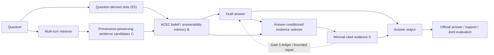

# ACEC v6.3 — Evidence-Bearing Answers and Joint Evaluation

Status: Gates 1-3 infrastructure implemented additively on 2026-07-23; the
production short-answer coverage audit and fixed-trace HotpotQA dev result are
still pending. The implementation passed local contract/provenance/selector
tests and exact parity against the unchanged official evaluator on fixtures.
Written 2026-07-22 as an additive companion to
`ACEC_V6.2_EVOLUTION_DIRECTION.md`; revised after the seven-point design review
to put the cheapest decisive results and the actual coverage claim ahead of
end-to-end architecture work.

V6.2 diagnoses the retrieval-to-answer conversion gap and proposes E1
(answerability utility), E2 (answer-turn groundedness), and E5 (question-derived
slots). V6.3 makes the missing interface explicit: the system must identify the
minimal evidence it used, preserve that evidence's native provenance, and emit
an answer plus an auditable evidence set. This is required for HotpotQA's
official supporting-fact and Joint metrics, but the core contract is
dataset-agnostic.

The current outcome-only run and all v1-v6 files remain unchanged. V6.3 must be
implemented only in new Python and shell entry points until it passes the gates
in Section 11.

The priority order is binding:

1. finish and evaluate the outcome-only answer baseline;
2. establish a deterministic short-answer contract;
3. obtain native sentence provenance in HotpotQA distractor mode;
4. test ACEC belief selection against generic NLI with question, answer, and
   ordered candidate trace fixed;
5. use a shared selector across policy arms only as an end-to-end sanity check;
6. introduce new sentence-level calibration or GRPO changes only if the first
   four results identify a real selector or grounding bottleneck.

---

## 1. The metric exposed a real architecture gap

HotpotQA evaluates three different objects:

1. the normalized answer string;
2. the exact set of supporting facts, represented as `(title, sentence_id)`;
3. their intersection.

For question `i`, the official evaluator computes:

```text
JointEM_i = AnswerEM_i * SupportingFactEM_i
```

`SupportingFactEM_i` is one only when the predicted set exactly equals the gold
set. One omitted fact or one extra fact makes it zero. Dataset Joint EM is the
mean of this per-question product, not the product of aggregate Answer EM and
aggregate Supporting-Fact EM. Official Joint F1 similarly combines per-question
answer and supporting-fact precision/recall. The official script remains the
source of truth:

`https://github.com/hotpotqa/hotpot/blob/master/hotpot_evaluate_v1.py`

The present code cannot produce this metric correctly:

- training records only title-level `found_sf` recall;
- v6 traces retain retrieved document ids/titles, not native sentence ids;
- retrieved paragraphs are flattened into strings, which discards the official
  sentence boundaries;
- the answer parser emits only an answer;
- every retrieved document is implicitly treated as context, but a retrieval
  pool is not a predicted evidence set.

Consequently, current `online_EM` and `SF_recall` cannot be converted into Joint
EM. This is not merely an evaluator omission. ACEC currently has no explicit
component responsible for the final decision: **which minimal facts justify
this particular answer?**

---

## 2. V6.3's central separation

V6.3 distinguishes three nested objects:

```text
retrieved candidates C  ->  belief-supported evidence B  ->  emitted evidence S
```

- `C` is everything returned by the retriever. It should favor recall.
- `B` is the evidence memory accepted by ACEC's calibrated belief. It should
  favor answerability and requirement coverage.
- `S` is the small final set cited for the emitted answer. It must favor exact
  support and minimality.

Normally `S subseteq B subseteq C`, with every exception explicitly logged.
The retriever may inspect many documents without declaring all of them as
supporting facts. This separation prevents the obvious Joint-EM failure mode in
which increasing retrieval recall also increases false-positive citations.

It also gives the efficiency result a more meaningful interpretation. V5's
fewer retrieval calls concern the cost of constructing `C`; V6.3 measures
whether ACEC can also construct a smaller, more exact `S` without losing answer
quality.

This produces three deliberately separate experiments:

| Experiment | Fixed variables | Variable | Claim isolated |
| --- | --- | --- | --- |
| selector attribution | question, short answer, ordered candidate trace `C` | generic NLI vs ACEC belief selector | whether calibrated coverage selects minimal evidence better |
| policy attribution | downstream selector | each policy's answer and `C` | whether training changes retrieval/answer behavior |
| complete system | none beyond dataset/protocol | policy plus selector | practical answer/evidence/cost Pareto, not causal attribution |

The **selector-attribution experiment is the evidence-axis load-bearing test**.
The shared-selector policy comparison remains necessary, but near-equal
candidate recall makes a Joint tie a strong prior; it is a sanity baseline, not
the main test of the ACEC coverage proposition.



---

## 3. A generic evidence contract, not a HotpotQA label model

The core runtime object is an `EvidenceUnit`, not a positive/negative/unknown
HotpotQA label:

```json
{
  "evidence_id": "dataset-native-or-derived-id",
  "source_id": "canonical source identity",
  "unit_index": 3,
  "text": "Exact source sentence text.",
  "document_id": "retriever document identity",
  "retrieval_turn": 2,
  "retrieval_rank": 1,
  "provenance_status": "native",
  "scores": {
    "requirement_support": 0.91,
    "answer_support": 0.87,
    "marginal_answerability": 0.24,
    "novelty": 0.78
  }
}
```

The contract permits raw semantic scores, calibrated posterior scores, and a
future continuous marginal-answerability score, but it records which one was
used. The first Joint evaluator uses only existing/raw NLI and existing ACEC
belief quantities. It does **not** claim that v5's document-level Bernoulli
calibration transfers to continuous sentence-level answerability.

A later calibrated selector may abstain when provenance or semantic assessment
is unreliable and must not turn ambiguous units into negatives. That later
calibration inherits the v5 marginal-utility and assessability discipline, not
the v5 artifact itself.

Dataset adapters only translate a selected generic unit into a benchmark's
native output:

- HotpotQA: `[title, sent_id]`;
- 2Wiki/MuSiQue: the dataset's native paragraph, sentence, or decomposition id;
- open-web/OOD data without official evidence annotations: stable source URI,
  passage id, and text span, evaluated for citation faithfulness rather than
  HotpotQA membership.

Two cardinalities must never be conflated:

- `K_slot`: the number of minimal question requirements used by the ACEC belief;
- `|S|`: the number of evidence units emitted for one answer.

One requirement can require multiple sentences, and one sentence can support
multiple requirements. V6.3 therefore does not add another hard-coded `K`
predictor. The first experiments report ranking separately from stopping; a
deployable marginal stop rule is added only after the ranking signal is known.

---

## 4. Provenance is a prerequisite, not post-processing

### 4.1 Distractor setting

HotpotQA's original `context.title` and `context.sentences` arrays already define
the official sentence ids. A new v6.3 preprocessor must preserve them as
structured documents. It must not reconstruct ids by running a generic sentence
tokenizer over the current flattened `"Title: sentence..."` strings.

Every retriever response used by v6.3 should carry:

```json
{
  "id": "question-scoped-document-id",
  "title": "Canonical HotpotQA title",
  "contents": "...",
  "sentences": ["sentence zero", "sentence one"],
  "sentence_ids": [0, 1],
  "provenance_status": "native"
}
```

Distractor is the first and primary route to a clean official Supporting/Joint
number. It is also the fixed-candidate selector benchmark: every method can see
the same ten paragraphs, exact sentence units, and the same draft answer. It
tests evidence selection, not open-domain retrieval efficiency.

### 4.2 Fullwiki setting requires the official 2017 corpus

The current `wiki18_100w` FAISS corpus is not accepted as the provenance source
for official Fullwiki Supporting/Joint metrics. It differs from HotpotQA's
official processed Wikipedia in dump date, paragraph/chunk boundaries, and
sentence segmentation. Title-level matching does not establish exact
`(title, sent_id)` identity, and a claimed 99% alignment would not be credible
without rebuilding against the benchmark source.

Fullwiki Joint therefore becomes a separate, higher-risk infrastructure line:

1. download the HotpotQA official 2017 processed Wikipedia release;
2. preserve its native title, paragraph, sentence text, and sentence index;
3. encode those official units and build a new versioned FAISS index;
4. return native provenance directly from the retriever;
5. run Fullwiki official metrics only against this index.

Modern embeddings and retrieval algorithms remain allowed. The non-negotiable
part is that the corpus and sentence identity come from HotpotQA's official
release.

An unmappable sentence may remain in `C` for answer generation, but it may not
be fabricated into an official `sp` prediction. It receives
`provenance_status="unmappable"`, is excluded from `S_official`, and is included
in provenance-coverage diagnostics.

Until the official index exists, current Fullwiki runs report answer quality,
title-level SF recall, retrieval calls, latency, and cost. They do not report an
official sentence-level Supporting/Joint number. Distractor Joint and current
Fullwiki efficiency are complementary results and must not be presented as one
setting.

### 4.3 Canonical title handling

Title identity must be obtained from corpus metadata, not guessed from the first
colon or first 40 characters. Unicode normalization, underscore/space aliases,
and redirect resolution may be used only through a versioned deterministic
mapping. The emitted title must be the official canonical title expected by the
evaluator.

### 4.4 Official split discipline

Use the provided splits according to their roles:

- partition official train ids into policy training, calibration, and internal
  validation with question-id disjointness;
- use the labeled dev distractor/fullwiki sets for fixed reported local
  evaluation under a frozen protocol;
- use the hidden-label test set only for the final official submission after
  method and thresholds are frozen.

Repeated tuning on official dev must be recorded. No test result may influence
selector weights, stopping thresholds, checkpoint choice, or answer parsing.

---

## 5. Evidence selection algorithm

### 5.1 Load-bearing fixed-trace comparison

The first selector experiment fixes all upstream variables:

```text
question q
deterministically parsed short draft answer a
ordered queries and retrieval-turn boundaries
ordered provenance-bearing candidate units C
```

Generic NLI and ACEC replay the same trace. This matters because the current
ACEC posterior is history- and action-conditioned; an unordered union of
passages is not sufficient input. On distractor data, a neutral trace is
generated once against the same ten-paragraph pool and cached. Neither selector
may change the query, candidate order, draft answer, or stopping point.

Report both all questions and the subset with a correct fixed draft answer. The
latter measures evidence selection without answer correctness dominating the
result.

### 5.2 Minimal selector ladder

The first official number uses the smallest selectors that can emit `S`:

1. **Generic answer-conditioned NLI.** Rank a sentence with the raw entailment
   score between the sentence and `H(q,a)`. This is explicitly uncalibrated.
2. **ACEC belief selector.** Use the existing document-level ACEC posterior and
   binding threshold to accept/filter evidence-bearing documents and slots.
   Within accepted documents, rank native sentences with the same raw NLI
   scorer used by the generic selector. Do not reinterpret the document
   posterior as a calibrated sentence-level answerability probability.

Both selectors use exactly the same evidence-count/stopping rule. Compare them
twice:

- with a gold-cardinality oracle to isolate ranking quality;
- with one deployable shared threshold/marginal stop to measure complete
  evidence prediction.

Gold cardinality is a diagnostic oracle, never a headline result. If the shared
threshold is selected using HotpotQA SF annotations, that result is explicitly
`hotpot_threshold_supervised`; it cannot support a no-SF-label claim.

The initial selector does not use `DeltaA_hat`, calibrated `p_ans`, calibrated
`p_contra`, bridge weights, redundancy weights, or a learned evidence-count
predictor. This keeps the first Joint number cheap and makes an ACEC-vs-NLI
difference attributable to the belief score rather than a new optimization
system.

### 5.3 Deferred sentence-level calibration (v6.2 E1)

`DeltaA_hat`, sentence-level answer support, and contradiction are new models,
not inherited capabilities. V5 calibrated a document-level Bernoulli marginal
coverage event; it did not validate continuous sentence-level answerability.

Only if the minimal experiment identifies selector ranking/stopping as a real
bottleneck may a new calibration artifact be built. It needs independent gates:

- question-disjoint fit/validation/test ids;
- AUC/AP for evidence ranking;
- Brier score/ECE for probability calibration;
- assessable-row coverage and abstention rate;
- correlation with measured marginal answer-score change;
- frozen threshold and OOD audit.

### 5.4 Deferred set utility and answer repair

A full set objective may later add grounding, requirement coverage, marginal
answerability, redundancy, size, bridge coherence, and contradiction. It is a
separate research component and is justified only when failure buckets show
that gold evidence is present in `C` but a one-score selector cannot recover the
exact set.

The first evaluator never regenerates the answer. After selector and short-answer
gates pass, one separate experiment may expose an evidence ledger to the policy
and permit one bounded answer repair. That experiment must retain the draft,
repaired answer, repair reason, and `answer_repair=true`; it cannot be compared
silently with one-pass baselines.

---

## 6. Making v6.2 E2 concrete without leaking SF labels

Official HotpotQA supporting-fact membership must **not** become the main ACEC
reward. Doing that would turn v6.3 into another gold-SF arm and invalidate the
general/OOD thesis in v6.2.

Terminology must remain honest: the present v5 artifact was calibrated with
HotpotQA supporting-fact annotations. It is label-free at runtime and does not
use per-example SF reward during GRPO, but the whole system is not strictly
label-free. Call it **calibration-only SF supervision** or **SF-label-efficient**.
Reserve `label-free` for a future artifact calibrated without HotpotQA SF
membership, for example from generic NLI/external evidence data or a frozen
gold-free judge.

The main ACEC reward remains generic:

```text
R = R_answer
  + eta * DeltaAnswerability_on_retrieval
  + beta * R_grounded_answer
  - retrieval_cost
  + existing_format/guard terms
```

Let `g in [0,1]` be calibrated support of the emitted answer by selected
evidence, and let `y` be the already-available terminal answer correctness
label. A safe first E2 shaping form is:

```text
R_grounded_answer = y * g - rho * (1-y) * g
```

This rewards a correct answer more when it is actually grounded and penalizes a
confidently evidence-supported wrong answer. A correct zero-hop answer with no
evidence receives no bonus, not a penalty. The existing low-coverage wrong-answer
guard handles unsupported premature answers. `beta` must remain small relative
to the unit answer reward and be frozen before the held-out run.

For clarity, three separate experiment arms are allowed:

| Arm | Uses gold answer during training | SF supervision | Claim |
| --- | ---: | ---: | --- |
| Outcome-only | yes | no | sparse terminal baseline |
| ACEC-v6.3 calibrated | yes | calibration artifact only | answerability + groundedness shaping |
| ACEC-v6.3 zero-shot | yes | no | genuinely label-free variant |
| Gold-SP reward | yes | yes | privileged supervised upper bound |

The gold-SP arm is useful, but it is not ACEC and cannot be used to establish
label-free training. It is expected to be strong on annotation-exact Joint EM
and belongs in a separate supervised-upper-bound block.

The purpose of E2 is not merely to improve citations. Evidence selected by the
belief must be fed back into answer generation or a bounded repair step so that
ACEC can exceed frozen R3 and outcome-only on the answer axis. An evidence-only
gain with unchanged answers is diagnostic progress, not the final v6.3 success
condition.

---

## 7. Output schemas

### 7.1 Internal auditable record

Every evaluated trajectory writes one strict JSONL record:

```json
{
  "question_id": "qid",
  "evaluation_setting": "fullwiki",
  "model_variant": "acec_step_50",
  "draft_answer": "answer text",
  "final_answer": "answer text",
  "retrieval_calls": 2,
  "candidate_evidence": [],
  "belief_evidence": [],
  "selected_evidence": [],
  "official_sp": [["Title A", 1], ["Title B", 0]],
  "selector_version": "acec_evidence_selector_v63",
  "answer_repair": false,
  "unmappable_candidate_count": 0
}
```

Candidate and selected entries contain exact text, provenance, scores, and the
selection/rejection reason. Gold answer and gold supporting facts are written
to a separate evaluator-side manifest and are never present in the runtime
selector input.

### 7.2 Short-answer contract (prerequisite to official Joint)

The current model often emits a wrapper or explanation around the answer. Since
`JointEM_i` contains `AnswerEM_i`, an official raw Answer EM near 0.094 would
cap Joint regardless of evidence quality. This is a prerequisite, not a metric
footnote.

Every model variant is therefore reevaluated with the same strict output
contract, for example:

```text
<answer>swimming</answer>
```

A deterministic parser extracts only the tagged span for the official
submission. This parser is part of the system and uses no model/judge call. The
contract, prompt, stop rules, and parser version are identical for frozen R3,
outcome-only, and ACEC. Qwen-72B processed-answer extraction remains a semantic
diagnostic; it is not used to construct the official answer field.

No Supporting/Joint headline is interpreted until the short-answer parser has
near-complete coverage and the remaining raw-vs-processed gap has been audited.

### 7.3 Official HotpotQA submission

The exporter produces only the official fields:

```json
{
  "answer": {
    "qid": "answer text"
  },
  "sp": {
    "qid": [["Title A", 1], ["Title B", 0]]
  }
}
```

Duplicates are removed with set semantics before serialization. The official
evaluator is invoked unchanged. Our code may parse its output but must not
reimplement the headline metric.

---

## 8. Evaluation protocol and metric hierarchy

### 8.1 Answer-axis dependency comes first

Before evidence engineering, complete the outcome-only run and evaluate frozen
R3, outcome-only, and ACEC on the same 256 held-out question ids with the
existing processed-answer protocol. Checkpoint 50 is primary; 25/75/100 diagnose
learning and over-optimization.

This result decides whether unchanged ACEC already improves answers, merely
matches outcome-only, or loses despite using fewer retrievals. It requires no
selector and is the cheapest decisive dependency for every later claim.

### 8.2 Load-bearing selector-attribution experiment

On native-provenance distractor data, compare generic answer-conditioned NLI and
the ACEC belief selector with the question, deterministic short answer, ordered
candidate trace, and stopping opportunity fixed. Use one cached manifest and
report both gold-cardinality ranking and deployable shared-stop results.

This is the direct evidence-axis test:

```text
Does ACEC's calibrated coverage belief select the annotated minimal evidence
more accurately than generic semantic entailment from the same information?
```

### 8.3 Shared-selector policy comparison is a sanity baseline

Then run a single frozen selector over each policy's own answer and retrieved
pool for frozen R3, outcome-only, and ACEC checkpoints. Use one question order,
retriever snapshot, temperature zero, and selector artifact. Because answer and
candidate recall are already close, a Joint tie is expected and does not refute
the selector-attribution result. This experiment isolates whether policy
training changed upstream answer/retrieval behavior; it does not test whether
the ACEC belief itself is the better selector.

Cache retrieved candidates so selector ablations do not rerun the LLM or
retriever. Distractor results compare only to distractor; current Fullwiki
results remain answer/efficiency metrics until the official 2017 corpus index
exists.

### 8.4 Metric hierarchy

After the short-answer contract passes, report the official six numbers:

- Answer EM / F1;
- Supporting-Fact EM / F1;
- Joint EM / F1.

Official Answer and Joint metrics use the raw answer passed to the official
normalizer **after deterministic tag parsing**. Qwen-extracted
`processed_EM/F1` remains a separate diagnostic and must never be called
official Joint EM. Before the short-answer contract passes,
`processed_answer_and_sp_em` may be reported as an explicitly non-official
diagnostic, but it is not the headline and stays out of leaderboard comparisons.

The primary scientific target is answer improvement: ACEC-v6.3 should exceed
both frozen R3 and matched outcome-only on processed answer quality and on the
official short-answer metrics at adequate power. Supporting/Joint and retrieval
cost explain the mechanism and guard against brute-force retrieval; they do not
replace the answer target.

### 8.5 Bottleneck metrics

Joint EM alone does not identify the failure. Also report:

- candidate gold-SF recall: whether `C` contains every gold fact;
- belief gold-SF recall: whether `B` retains every gold fact;
- selector precision/recall/F1 and exact-set EM;
- selector exact-set EM conditioned on full gold evidence being in `C`;
- answer EM conditioned on full gold evidence being in `C`;
- emitted evidence count, retrieved sentence count, documents and calls;
- provenance mapping coverage;
- answer/evidence contradiction and faithfulness score;
- per-question failure bucket.

Required mutually exclusive **earliest-bottleneck** buckets are evaluated in
the following order:

```text
retrieval_missing_gold
belief_dropped_gold
selector_missing_and_extra
selector_missing_gold
selector_added_extra
answer_wrong_with_exact_evidence
joint_exact
```

Once a question enters a bucket, later buckets are not considered. Report a
separate answer-correctness by evidence-exactness 2x2 table so wrong-answer plus
wrong-evidence cases remain visible without double-counting the bottleneck
buckets. Together these diagnostics connect directly to v6.2: they tell us
whether E1 must improve retrieval, E5 must improve requirement coverage, the
v6.3 selector must improve minimality, or E2 must improve evidence-to-answer
conversion.

### 8.6 Statistical reporting

Use paired bootstrap confidence intervals on the fixed question ids for Answer,
SP, and Joint deltas. Because Joint EM is an intersection event and normally
lower-base-rate than Answer EM, the n=256 single-seed limitation in v6.2 is even
more severe. Treat a small single-seed Joint delta as directional only.

---

## 9. The necessary selector baselines and oracles

The evidence selector needs its own ablation table; otherwise an ACEC result can
be an artifact of the post-processor.

1. **All retrieved sentences:** high-recall, low-precision failure baseline.
2. **Retriever top-k sentences:** no ACEC belief.
3. **Answer-conditioned raw NLI:** the first generic selector; no new
   calibration and no ACEC coverage.
4. **ACEC requirement coverage:** existing belief score on the same fixed trace
   and with the same stopping rule; the load-bearing comparator.
5. **Gold cardinality oracle:** uses only gold `|S|`, not membership; diagnostic
   upper bound for stopping errors and never a deployable result.
6. **Gold evidence oracle:** feeds the gold set to the evaluator/answerer;
   separates answer failure from retrieval/selection failure.
7. **ACEC + calibrated sentence answerability:** deferred E1 ablation after its
   independent calibration gate.
8. **Full set utility:** deferred and added only after a demonstrated selection
   bottleneck.

A HotpotQA-supervised evidence classifier may be reported as an additional
upper bound and is expected to be strong on annotation-exact Joint. The primary
claim is not highest Joint against a fully supervised selector. The
selector-attribution experiment compares supervision-matched ACEC and NLI; the
policy-attribution sanity check gives all policy arms the exact same frozen
selector.

---

## 10. What V6.3 can and cannot prove

### 10.1 Primary target: stronger answers than R3

The intended complete result is not merely equal answers with fewer retrievals.
V6.3 must use more accurate evidence identification and evidence-to-answer
conversion to make ACEC **stronger than frozen R3 and matched outcome-only on
held-out answer quality**. The paper-level success target is a reproducible,
adequately powered improvement on processed EM/F1 and official short-answer
EM/F1, with Supporting/Joint improvement explaining why it happened.

The hypotheses are:

1. ACEC belief ranks minimal answer-bearing evidence more accurately than a
   generic NLI selector on the same information.
2. Feeding that evidence back through an evidence ledger/grounded answer step
   converts the evidence advantage into higher answer accuracy.
3. The gain does not come from unbounded retrieval calls or privileged per-item
   SF reward.

A ≥2-point answer improvement over both frozen R3 and outcome-only is the
directional target inherited from v6.2; the final claim requires paired
confidence intervals and multiple seeds or a larger held-out set. If v6.3 only
matches answers while reducing retrievals, that is a useful fallback finding,
but it is explicitly **not completion of the primary objective**.

### 10.2 Correct positioning against supervised evidence systems

The claim is not highest annotation-exact Joint EM against a fully supervised
HotpotQA evidence classifier. Such a classifier is optimized for the benchmark
labels and is expected to win that axis. The intended positioning is:

```text
best answer / evidence / retrieval-cost Pareto among supervision-matched
no-per-example-SF-reward methods
```

For the current artifact, say `calibration-only SF supervision` rather than
strictly label-free. Report a genuinely zero-shot artifact separately if built.
The supervised gold-SP arm is an upper bound, not evidence that ACEC failed at
its stated supervision regime.

### 10.3 What a tie would mean

A shared-selector Joint tie is expected when policy candidate pools and answers
are close; it says little about whether ACEC is the better selector. A fixed-
trace ACEC-vs-NLI tie is more damaging: it means the calibrated coverage belief
does not identify minimal evidence better than generic entailment. If evidence
selection improves but answer quality does not, E2/evidence-to-answer conversion
is the remaining bottleneck and the system has not yet met its primary target.

HotpotQA Joint EM also has a known conceptual limitation for the paper's broader
claim: it treats one annotated evidence set as exact, so an alternative valid
supporting sentence is a false positive/negative under the benchmark. Therefore
report official Joint metrics for comparability and citation faithfulness/
answerability metrics for the dataset-agnostic claim. Do not train the core ACEC
belief to imitate annotation membership merely to improve one leaderboard.

---

## 11. Gates and implementation order

### Gate 0 — Finish the decisive answer baseline

- complete outcome-only 100 episodes without disturbing the live run;
- evaluate frozen R3, outcome-only, and ACEC checkpoints on the identical 256
  held-out ids;
- compute processed EM/F1, paired wins/losses, retrieval calls, SF-title recall,
  and bootstrap intervals;
- make checkpoint 50 the primary comparison and use 25/75/100 only for trend
  and over-optimization diagnosis.

No evidence-selector engineering precedes this result. It establishes the
answer gap that v6.3 must overcome.

### Gate 1 — Short-answer output contract

- one shared tagged-answer prompt/parser for every arm;
- deterministic extraction with near-complete parse coverage;
- no Qwen/API extractor in the official answer field;
- audit raw tagged Answer EM against processed EM before interpreting Joint.

Failing Gate 1 means repair the output contract. Evidence quality cannot rescue
an answer string that the official evaluator marks wrong for wrapper text.

### Gate 2 — Distractor provenance and official parity (CPU)

- 100% of distractor sentences round-trip to native `(title, sent_id, text)`;
- official evaluator output is reproduced on its sample fixture;
- runtime selector payload contains no gold answer/SF membership;
- exporter deduplicates evidence with exact set semantics;
- train/calibration/internal-validation/dev/test question ids are disjoint as
  declared by the experiment manifest.

### Gate 3 — Fixed-trace ACEC-vs-NLI selector test

- cache one neutral ordered distractor trace and one fixed short answer per id;
- replay generic raw NLI and existing ACEC belief over the identical trace;
- use identical stopping rules;
- report gold-cardinality ranking, deployable SP EM/F1, correct-answer subset,
  and failure buckets;
- do not use `DeltaA_hat` or the full set objective.

This is the evidence-axis load-bearing gate. Continue to a new selector only if
ACEC shows a credible advantage or the diagnostics identify a specific repair.

### Gate 4 — Shared-selector policy sanity check

Apply one frozen minimal selector to each policy's own answer and `C`. A tie is
an expected possible result and is interpreted as similar upstream pools, not
as disproof of Gate 3. This gate validates end-to-end accounting and policy
attribution; it is not the central coverage test.

### Gate 5 — Evidence-to-answer conversion

Expose ACEC-selected evidence as an evidence ledger while retaining raw context
and run a frozen/checkpoint behavioral evaluation before training. The target is
an answer improvement over the same checkpoint without the ledger, not merely
better citations. If needed, test one explicitly labeled bounded repair pass.

Proceed only if answer quality improves or the experiment yields a precise,
repairable conversion failure. Context compression is a separate efficiency
ablation.

### Gate 6 — New sentence calibration and E1/E2 training

Only after Gates 0-5, build a separately gated sentence-level artifact and an
isolated v6.3 trainer. Run 1 episode for contract validation, then 25/50. Do not
jump to 100: v6.2 found a healthy horizon near 50 and over-optimization at
75/100.

The training success gate is higher held-out answer quality than both frozen R3
and outcome-only under the same protocol. An efficiency-only result is recorded
as fallback, not declared the primary objective achieved.

### Gate 7 — Official Fullwiki 2017 index and OOD

Build the official HotpotQA 2017 processed-Wikipedia index before reporting
Fullwiki sentence-level Supporting/Joint. In parallel or afterward, implement a
non-Hotpot adapter without changing the selector core. These are separate
generalization/infrastructure tracks and cannot block the cheap distractor
selector result.

---

## 12. Isolated implementation map

Keep the first implementation small. Existing v1-v6 files are not edited.

Immediate files for Gates 1-4:

```text
rag/src/belief/acec/evidence_contract_v63.py
rag/src/belief/acec/evidence_selector_minimal_v63.py
rag/src/belief/acec/datasets/hotpotqa_v63.py
rag/train/short_answer_contract_v63.py
rag/train/eval_hotpot_joint_v63.py
run_scripts/prep_hotpot_distractor_provenance_v63.py
run_scripts/37_eval_v63_fixed_trace_selectors.sh
rag/train/tests/test_evidence_contract_v63.py
rag/train/tests/test_hotpot_official_parity_v63.py
rag/train/tests/test_evidence_selector_minimal_v63.py
```

Deferred files, created only after their gates:

```text
rag/src/belief/acec/answerability_calibration_v63.py  # Gate 6
rag/train/grpo_rsf_vllm_v63.py                       # Gate 6
run_scripts/38_validate_v63_evidence_two_h100.sh     # Gate 6
run_scripts/prep_hotpot_fullwiki_2017_v63.py         # Gate 7
run_scripts/build_hotpot_fullwiki_2017_index_v63.sh  # Gate 7
```

Every selector artifact records:

```text
schema/version
git commit
utility provider
selector mode (raw_nli / acec_existing / sentence_calibrated / supervised_upper_bound)
feature model versions
thresholds and marginal-stop rule
provenance adapter/version
fit/validation question-id hashes
official evaluator hash
```

New launchers must perform the existing `.git/index.lock`, artifact, endpoint,
GPU separation, and non-empty-output checks. Evaluation artifacts are immutable
and refuse to overwrite prior results.

---

## 13. Decision table after the first Joint evaluation

| Observed result | Diagnosis | Next action |
| --- | --- | --- |
| Outcome-only beats ACEC on held-out answers | current process shaping does not improve answer generalization | require evidence-selection and E2 conversion gains before any new long training |
| ACEC beats frozen R3 and outcome-only on answers | primary answer signal exists | confirm seeds, then explain with evidence/efficiency metrics |
| Fixed-trace ACEC selector beats NLI | coverage posterior has evidence-axis value | move to evidence ledger/E2 conversion |
| Fixed-trace ACEC selector ties NLI | current belief adds no minimal-evidence signal | redesign slots/calibration before training |
| Candidate SF recall is low | retrieval is the bottleneck | implement E1/E5 retrieval changes; do not tune selector |
| Candidate recall high, selector EM low | minimal evidence selection is the bottleneck | calibrate marginal stop/answer conditioning |
| SP EM high, Answer EM low | evidence-to-answer conversion is the bottleneck | implement E2 ledger/groundedness |
| ACEC beats R3/outcome on answers and improves Joint | primary v6.3 target reached directionally | repeat seeds, scale held-out, and test OOD |
| ACEC only matches answers with fewer calls | efficiency fallback only | do not declare primary objective complete; continue E1/E2 or reframe |
| Outcome-only wins Answer and Joint | current ACEC shaping is not helping | stop scaling v5/v6; redesign E1 target |
| Supervised selector wins Joint | expected annotation advantage | keep as upper bound; compare supervision-matched Pareto |
| Both systems have low official SP but high faithfulness | annotation/provenance mismatch | report benchmark limitation; audit adapter |

The first dependency is the completed outcome-only answer evaluation. The first
v6.3 evidence experiment is then a provenance-correct distractor comparison of
ACEC belief vs generic NLI with `q`, short answer, and ordered `C` fixed. The
shared-selector end-to-end run follows as a sanity baseline. Only those results
decide whether sentence calibration, E2, or another GPU training run deserves
the next hour.
